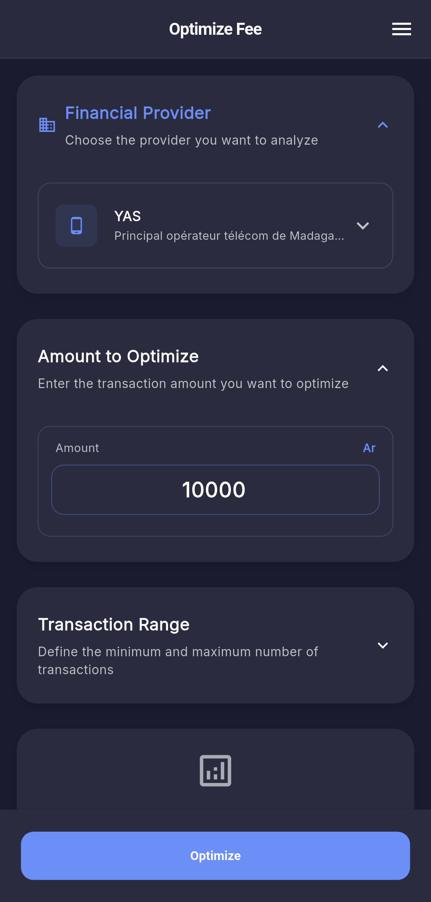
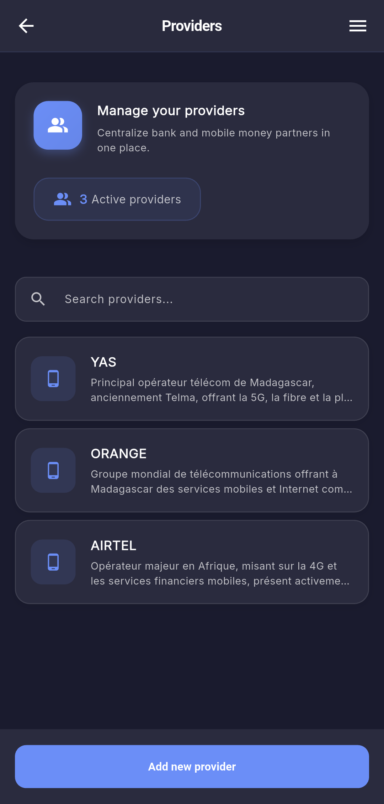
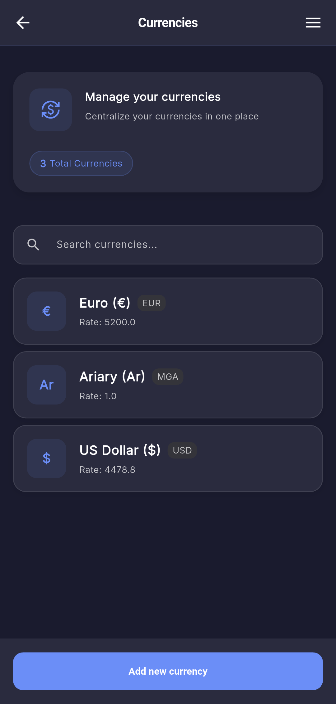
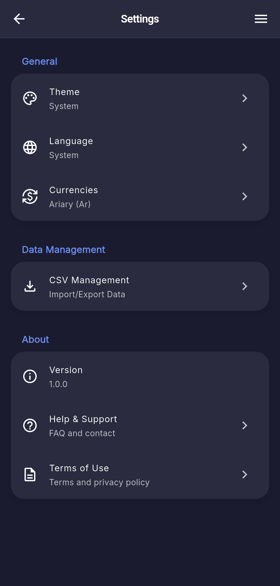
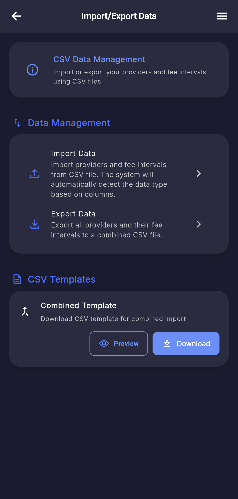

<div align="center">

<h1 style="display:flex;align-items:center;justify-content:center;gap:0.5rem;margin:0;">
	
	Feezer
</h1>

### *Smart Transaction Fee Optimization*

[](https://flutter.dev)
[](#)
[](#)

**Feezer** empowers you to calculate, compare, and optimize transaction fees across multiple financial providers.  
Make smarter financial decisions and minimize costs with advanced fee analysis and optimization algorithms.

[📥 Download](#-download--installation) • [✨ Features](#-features) • [📸 Screenshots](#-screenshots) • [📖 Documentation](#-how-to-use)

---

</div>

## ✨ Features

### 🎯 Core Capabilities

- **Provider Management** — Create and manage financial service providers with custom fee structures
- **Multi-Currency Support** — Handle multiple currencies with configurable exchange rates
- **Advanced Fee Analysis** — Define complex fee intervals with minimum/maximum thresholds
- **Optimization Engine** — Intelligent algorithms to find optimal transaction amounts
- **Cost Comparison** — Detailed breakdowns comparing optimized vs. standard scenarios

### 🎨 User Experience

- **Multilingual Interface** — Available in multiple languages for global accessibility
- **Theme Customization** — Elegant light and dark modes to match your preference
- **Intuitive Design** — Clean, modern interface optimized for mobile devices
- **Data Portability** — CSV import/export for effortless data management

### ⚡ Advanced Capabilities

- **High-Precision Calculations** — Accurate financial computations using advanced algorithms
- **Real-time Search** — Quickly find providers, currencies, and fee information
- **Cross-Platform** — Optimized for both Android and iOS platforms

---

## 📸 Screenshots

<div align="left">

| 💸 Fee Optimization | 🏦 Provider Management | 💱 Currency Management |
|:---|:---|:---|
|  |  |  |
| Calculate optimal amounts to minimize fees | Browse and manage financial providers | Manage currencies and exchange rates |

| ⚙️ Settings & Preferences | 📂 Data Management | |
|:---|:---|:---|
|  |  | |
| Customize language, theme, and preferences | Import and export data for backup | |

</div>

---

## 📥 Download & Installation

### 📱 Android

Download the latest APK from the **[Releases](../../releases)** section.

#### Installation Steps

1. Download the APK file to your Android device
2. Enable *"Install from Unknown Sources"* in your device settings
3. Open the downloaded APK file
4. Follow the installation prompts
5. Launch the app and complete onboarding

### 🍎 iOS

> Coming soon! iOS version is currently in development.

---

## 🛠️ Tech Stack

Built with modern mobile technologies for optimal performance:

```
Framework      → Flutter
Platforms      → Android & iOS
Database       → SQLite (Local Storage)
UI Design      → Material Design
Architecture   → Clean Architecture
```

---

## 📖 How to Use

### 🚀 Getting Started

1. **Install** the app on your mobile device
2. **Complete onboarding** — set your preferred language and theme
3. **Add currencies** — start with your primary currency (e.g., USD, EUR)
4. **Create providers** — add financial services with their fee structures

### 🏦 Managing Providers

- Access the *Provider List* from the main menu
- Add new providers with detailed fee information
- Define fee intervals for different transaction ranges
- Use search to quickly locate specific providers

### 💸 Optimizing Transactions

1. Navigate to the *Fee Optimization* screen
2. Select your provider and enter transaction details
3. Specify the number of transactions and amounts
4. Review optimization results and cost savings

### 📊 Data Management

- Use the CSV import/export feature in *Settings*
- Download data templates for bulk entry
- Regularly backup your provider and currency data
- Restore data across devices seamlessly

---

## 🔒 Privacy & Security

Feezer prioritizes your privacy and data security:

| Feature | Description |
|---------|-------------|
| 🏠 **Local Storage** | All data stored locally on your device |
| 🚫 **No Account Required** | Use the app without registration |
| 📤 **Data Export** | Full control with CSV export options |
| 👁️ **No Tracking** | Zero data collection or sharing |

---

## 📞 Support & Feedback

Need help or have suggestions?

- 📚 Check the app's built-in help section
- 🐛 Visit the [Issues](../../issues) page for known problems
- 💬 Contact support through the app's feedback feature
- ⭐ Star this repository if you find it useful!

---

## 📄 License

This project and its assets are **proprietary**.  
The application is provided *as-is* for personal use.

---

## 🙏 Acknowledgments

- Built with [Flutter](https://flutter.dev) framework
- Inspired by financial optimization principles
- Designed for users seeking better financial control

---

<div align="center">

### 💡 **Optimize your transactions with Feezer** 📊

*Making every transaction count*

</div>